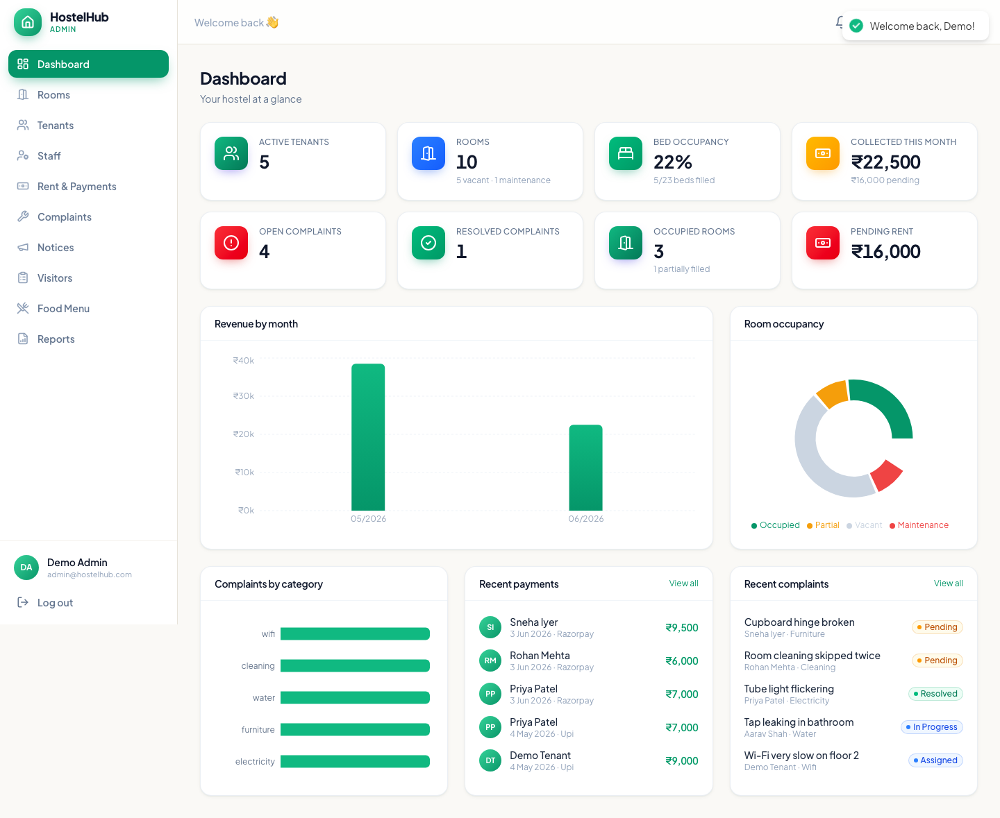

<div align="center">

# 🏠 HostelHub

### Smart PG &amp; Hostel Management — run your entire property from one dashboard

Rooms &amp; beds · online rent collection · complaints · visitors · food menu · notices · documents · analytics
— with dedicated **Admin**, **Resident** and **Staff** portals.

[](https://github.com/prashant1234568/hostelhub/actions/workflows/ci.yml)


</div>

<p align="center">
  
</p>

---

## ✨ Features

| Module | What it does |
|--------|--------------|
| **Rooms &amp; beds** | Floors, rooms, bed-level occupancy, room types, one-click tenant assignment |
| **Rent &amp; payments** | Auto-generate monthly rent, online payment via **Razorpay**, GST-ready **PDF receipts**, manual cash/bank entry |
| **Complaints** | Residents raise → staff resolve → live status, priority, ratings &amp; feedback |
| **Visitors** | Pre-registration, gate check-in/out, full audit log |
| **Notices** | Category-coded notice board with pin &amp; urgent email blasts |
| **Food menu** | Weekly mess menu with per-meal resident feedback |
| **Documents** | Agreements &amp; verification docs per resident |
| **Reports** | Revenue, occupancy, pending rent &amp; complaint analytics, **CSV export** |
| **Auth &amp; roles** | JWT (access + httpOnly refresh), role-based access for Admin / Resident / Staff |

## 🧱 Tech stack

- **Frontend** — React 18 · Vite 5 · React Router 6 · Tailwind CSS v4 · framer-motion · Recharts · Axios · react-hot-toast
- **Backend** — Node/Express · MongoDB (Mongoose) · JWT · Zod · Nodemailer · Razorpay · PDFKit
- **Tooling** — Vitest + Testing Library (web) · Vitest + Supertest (API) · ESLint · GitHub Actions CI · Docker

## 📁 Structure

```
hostelhub/
├─ client/            # React + Vite SPA
│  ├─ src/
│  │  ├─ api/         # axios instance (token + refresh-on-401)
│  │  ├─ components/ui/   # shared UI kit + motion + charts theme
│  │  ├─ context/     # AuthContext
│  │  ├─ layouts/     # role-aware dashboard shell
│  │  └─ pages/       # public | admin | tenant | staff | shared
│  └─ test/           # Vitest unit/component tests
├─ server/            # Express API
│  ├─ src/
│  │  ├─ config/      # db + env validation
│  │  ├─ controllers/ models/ routes/ middleware/ services/  validators/
│  │  └─ seed/        # demo data
│  └─ test/           # Vitest + Supertest API tests
├─ docker-compose.yml # one-command stack (mongo + api + web)
├─ render.yaml        # Render blueprint
└─ .github/workflows/ # CI
```

## 🚀 Quick start (local dev)

> Requires Node 20+. No MongoDB install needed — dev uses an **in-memory MongoDB** that auto-seeds demo data.

```bash
# 1) API → http://localhost:5000
cd server && npm install && cp .env.example .env && npm run dev

# 2) Web → http://localhost:8080  (new terminal)
cd client && npm install && npm run dev
```

Open **http://localhost:8080**.

### 🔑 Demo logins

| Role | Email | Password |
|------|-------|----------|
| Admin | `admin@hostelhub.com` | `Admin@123` |
| Resident | `tenant@hostelhub.com` | `Tenant@123` |
| Staff | `staff@hostelhub.com` | `Staff@123` |

> Dev shortcut: `http://localhost:8080/login?demo=admin` (also `?demo=tenant` / `?demo=staff`) auto-logs in.

## ⚙️ Configuration

**Server** (`server/.env` — see `server/.env.example`): `PORT`, `MONGO_URI`, `USE_MEMORY_DB`, `JWT_ACCESS_SECRET`, `JWT_REFRESH_SECRET`, `CLIENT_URL` (comma-sep for multiple origins), `SMTP_*`, `RAZORPAY_KEY_ID/SECRET`, `BUSINESS_NAME/ADDRESS/GSTIN`.

**Client** (`client/.env` — see `client/.env.example`): `VITE_API_URL` (only for split deploys; same-origin uses `/api`).

> Payments and email work without keys in dev — Razorpay runs in **mock mode** and emails are **logged to the console**. Add real credentials to go live.

## 🧪 Testing

```bash
cd server && npm test      # API: auth, RBAC, rooms CRUD, validation (Vitest + Supertest)
cd client && npm test      # UI kit + helpers (Vitest + Testing Library)
cd client && npm run lint  # ESLint
```

CI runs all of the above on every push/PR via GitHub Actions.

## 🐳 Deployment

### Option A — Docker (self-host, one command)

```bash
cp .env.example .env        # set JWT_ACCESS_SECRET + JWT_REFRESH_SECRET
docker compose up -d --build
# → web on http://localhost:8080, API proxied at /api, MongoDB persisted in a volume
```

The web image (nginx) serves the SPA and proxies `/api` + `/uploads` to the API — so the browser sees a single origin (no CORS). Uploaded files persist in the `uploads` volume.

### Option B — Managed cloud (Vercel + Render + Atlas)

1. **Database** — create a free **MongoDB Atlas** cluster, copy its connection string.
2. **API** — deploy `server/` to **Render** (the `render.yaml` blueprint is included). Set `MONGO_URI` (Atlas) and `CLIENT_URL` (your web URL). JWT secrets are auto-generated.
3. **Web** — deploy `client/` to **Vercel** (or Render static). Set `VITE_API_URL` to the API URL + `/api`. `vercel.json` handles SPA routing.

> For a clean production tenant, set `SEED_ON_BOOT=false` and create your own admin.

## 🗺️ Roadmap

- Multi-property / multi-tenant SaaS mode (currently one instance per client)
- Razorpay webhooks &amp; refunds, OTP/WhatsApp notifications
- Cloud file storage (S3/Cloudinary), Sentry error tracking

## 📄 License

[MIT](LICENSE) © HostelHub
